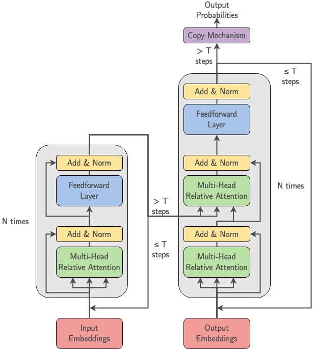

## Towards Autoformalization of Mathematics and Code Correctness: Experiments with Elementary Proofs

Repository for code & data related to autoformalization experiments with elementary arithmetic and code correctness proofs.

Presented in the MathNLP workshop at EMNLP 2022.

Code related to the model, including training and evaluation, is found in `src/`.

Code related to the dataset, as well as pre-generated data, is found in `data/`.

### Contents
1. [Prerequisites](#Prerequisites)
2. [Dataset](#Dataset)  
  2.1 [Format](#Format)  
  2.2 [Generating Data](#Generating_Data)  
  2.3 [Evaluating Data](#Evaluating_Data)
3. [Model](#Model)  
  3.1 [Architecture](#Architecture)  
  3.2 [Training a Model](#Training_a_Model)  
  3.3 [Evaluating a Model](#Evaluating_a_Model)
  
<h3 id=Prerequisites>1. Prerequisites</h3>
In order to run the code for dataset generation, training, and evaluation, the following dependencies are required:

- Python 3
- Numpy
- PyTorch
- Coq 8.13.* w/ coqtop (for automatic proof-checking)
- Software Foundations Vol. 2, Programming Language Foundations (incl. in `data/`, see README for compiling)

<h3 id=Dataset>2. Dataset</h3>
A pre-generated version of our dataset, used for training and evaluation in the paper, is contained in `data/` alongside scripts for generating examples and automatically evaluating proofs. Included are examples of human-written LaTeX proofs and a version of Programming Language Foundations (Pierce et al. 2010).

<br>`examples.py` is the script for generating new examples for each subset of the dataset. The context-free grammar for each example type is contained in `grammar.py`.

`detokenizer.py` is a script for automatically detokenizing generated Coq code and automatically evaluating for correctness using the Coq type-checker.

See the README in `data/` for info on running these scripts.

<b id=Format>2.1 Format</b>

Folders containing data are expected to have the following structure:
```
name/
├training/
├test/
...
└other/
```
That is, at least one folder labelled `training/` for training examples, and other folders of arbitrary names for testing. Choosing which folder to use for evaluation is done with the `--test` option (see [Sec. 3.3](#Evaluating_a_Model) or `src/README.md`).

The examples themselves are structured in the following manner:
```
LaTeX input sequence
~
Coq target sequence
```
Data is pre-tokenized and contained in a series of .txt files for processing.

<b id=Generating_Data>2.2 Generating Data</b>

Generating new examples is done with the `examples.py` script. To generate the poly dataset, create the file structure
```
data/
└poly/
 ├training/
 └test/
```
then use the following commands:
- `python3 examples.py -t=poly -p=poly -n=5000 -s=training`
- `python3 examples.py -t=poly -p=poly -n=5000 -s=test`

For a more detailed explanation of options and usage, see the README in `data/`.

<b id=Evaluating_Data>2.3 Evaluating Data</b>

Evaluating generated Coq proofs for semantic correctness is done with the `detoknizer.py` script. Given a .txt file containing the output of the model, the script will detokenize and automatically check the theorem's/proof's validity via coqtop. That is, it will poll Coq's type-checker for any potential errors. Results are given in two pieces: (a) Did the generated theorem match the ground truth? (b) Did the entire program type-check without errors? These are combined into a "Both" result that defines our "semantic-level" accuracy metric.

For details on running this script and usage, see the README in `data/`.

<h3 id=Model>3. Model</h3>
Code for the implementation of our model, training, and testing is contained in `src/`. For a detailed tutorial on options, usage, and format, see the README in `src/`.

<br><b id=Architecture>3.1 Architecture</b>

We use a modified Transformer architecture with the following changes:
- Numbers, variables, and general mathematical terminology are encoded with generic tokens that still preserve co-reference information.
  + That is, we distinguish the first `N` numbers with `<nat1>, ..., <natN>` and the first `N` variables with `<var1>, ..., <varN>`. These assignments are matched between LaTeX and Coq sequences.
- We generate probabilities using a copying mechanism. Numbers, variables, general OOV jargon, etc. are copied from the input sequence.
- Absolute positional encodings are removed.
- Relative positional encodings are included in self-attention.
- The encoder and decoder are allowed `T` recurrent passes.

The following figure shows the architecture visually:



<b id=Training_a_Model>3.2 Training a Model</b>

To train the model on a dataset, the following command format is used:
- `python3 translate.py [options (see src/README.md)] --dataset_path=./path/to/data`
Ensure that data conforms to the format described in [Sec. 2.1](#Format).

<b id=Evaluating_a_Model>3.3 Evaluating a Model</b>

To test the model, the following command format is used:
- `python3 translate.py [options (see src/README.md)] --dataset_path=./path/to/data --test=name_of_test_folder`
Ensure that data conforms to the format described in [Sec. 2.1](#Format).
